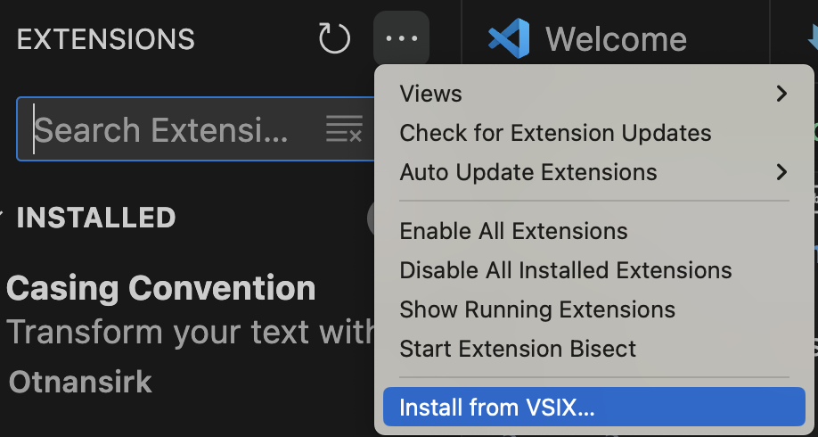
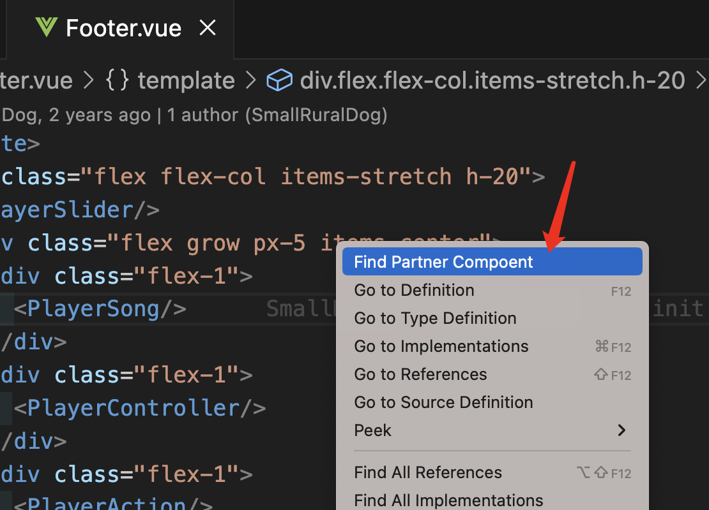
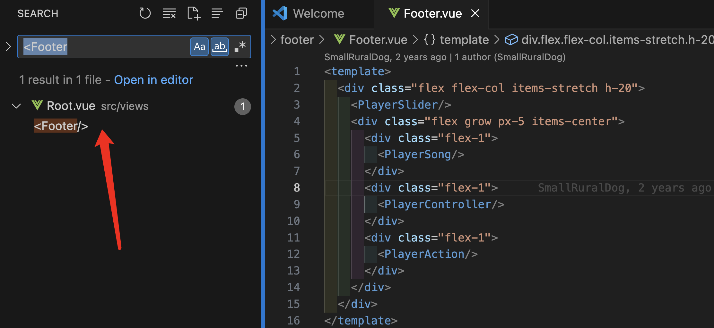

# vue-find-partner-compoent README

an extension to find vue parent compoent

# package & install
using below command

npm i vsce -g
vsce package

you will get a vsix file. just install it into your vscode

# usage demo
open the vue file and click 'Find Partner Compoent' inside the menu

there it is
