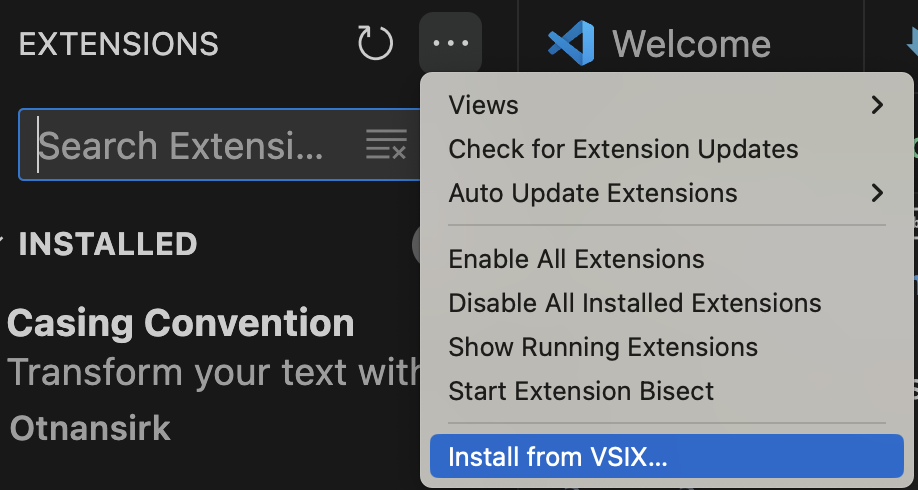
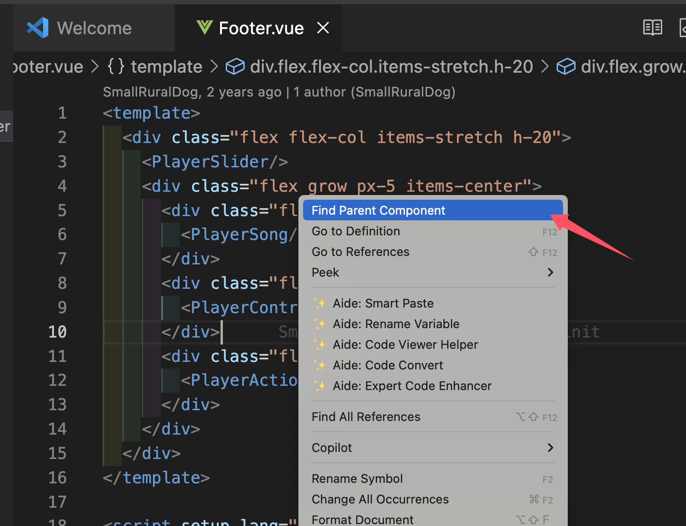
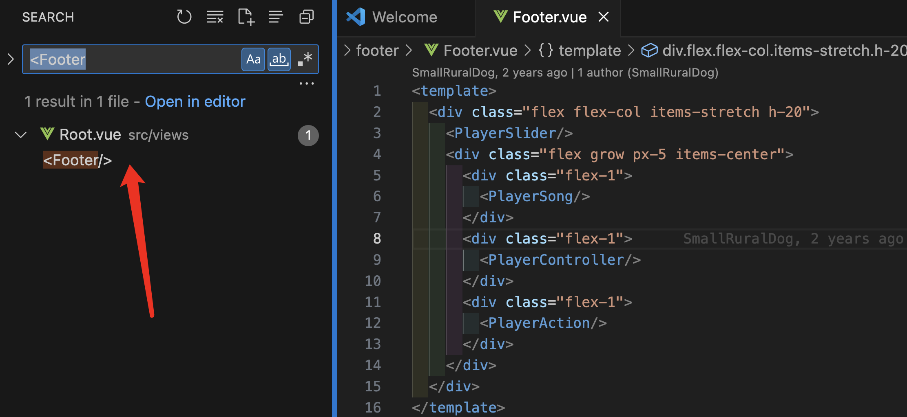

# vue-find-parent-component README

a vscode extension to find vue parent component


## install
Search `vue-find-parent-component` in Marketplace.

Or, package and install vsix file by yourself.

### packaging method
Using below command

```
npm i vsce -g
vsce package
```
You will get a vsix file. Just install it into your vscode


# usage demo
Open a vue file and click 'Find Parent Component' inside the menu.



There it is!
